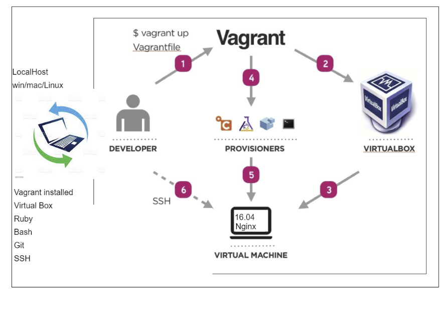

# DevOps Intro
## Life Before DevOps
- Developers used to make software and give it to Operations and it wouldn't work because environments were different and the only thing Developers could say was "It was working on my machine"
### why DevOps
- **DevOps Introduction**
- Devops is the merging of the development and operations team
- A collaboration of Development and Operations
- A culture which promotes collaboration between Development and Operations team to deploy code to production faster in an automated and repeatable way
- A practice of development and operation engineers taking part together in the whole service lifecycle
- An approach through which superior quality software can be developed quickly and with more reliability
- An alignment of development and IT operations with better communication and collaboration
#### Key Pillars of DevOps
- Ease of Use
- Robustness
- Cost Effective
- Flexibility
##### Monolith Architecture
- Everything works in the same package
- Bad for agile because you have to finish the entire app before you can deliver anything

### Development Environment

- Create `vagrantfile` in the current location
'''
Vagrant.configure("2") do |config|

 config.vm.box = "ubuntu/xenial64"
# creating a virtual machine ubuntu

# assign private ip to our VM
 config.vm.network "private_network", ip: "192.168.10.100"

# ensure to install hostsupdater plugin on our localhost
 config.hostsupdater.aliases = ["development.local"]

end
'''
